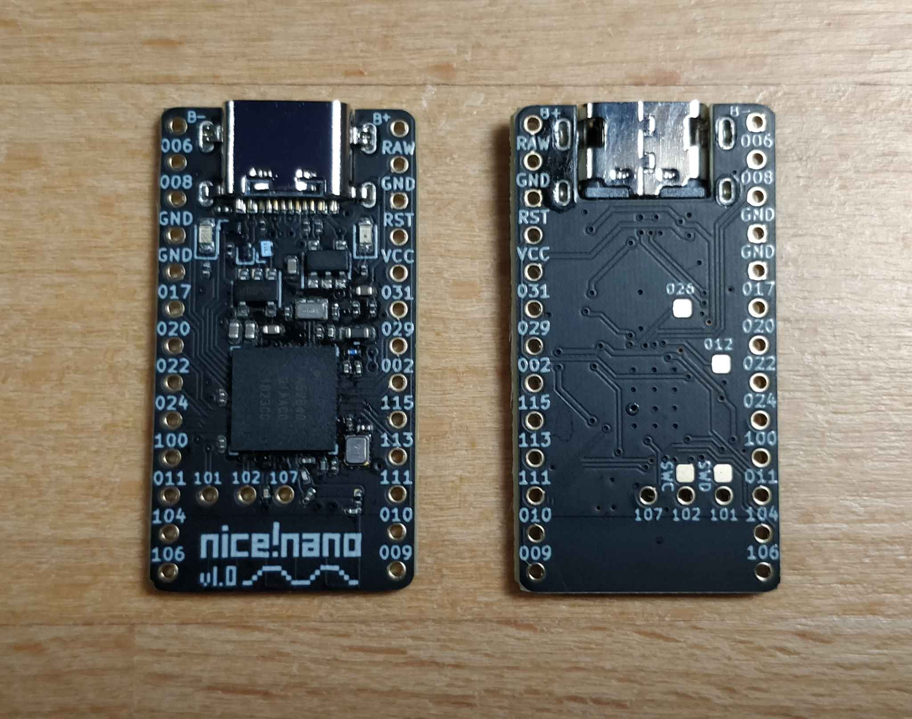

# nice!nano

The nice!nano is a Pro Micro replacement development board offering BLE using the nRF52840 chip. It has the same pinout as the Pro Micro meaning it will work with almost any Pro Micro keyboard. The nice!nano also has a 3.7V lithium battery charger on board as well as a software level switch to cut off power to LEDs, which can eat 1mA each even when off!

Check out [**FAQs**](/nice!nano/faq) if you have more questions. To get your nice!nano up and running check out [**Getting Started**](nice!nano/getting_started).

If you're a hardware designer interested to learn more about the pinout and schematic check out the [**Pinout and Schematic**](nice!nano/pinout_schematic).

## Recommended batteries and sockets

To run your nice!nano wirelessly, you need a battery. In specific, you need a 3.7v rechargeable lithium battery that is at least 100mAh large (you can probably get away with 80mAh). Note when choosing a battery, the recharge rate is 100mA, so a 2,000mAh battery will take 20 hours to charge. **The overall recommended battery for most low power (no LEDs or extra power sinks) is the 301230 battery**. This battery is 3mm thick and fits underneath a socketed nice!nano very nicely. These can be found on some vendors' stores as well as on AliExpress.

It's also highly recommended that you socket your nice!nano. It offers ease of access to the battery and makes debugging your keyboard so much easier. In short, it's a small investment to save you lots of time and possibly money in the future. **Standard female machine pin sockets are recommended to go along with the 301230 battery**. In most cases the battery should fit underneath the socketed nice!nano. Be weary o flipped nice!nanos *with* pins and other parts underneath (you don't want to puncture your battery!). You can find these on AliExpress all over the place.

## Specifications

- Mid mount USB-C port making the board a 3.2mm total thickness (thinner than a Pro Micro)
- nRF52840 chip on board with 1MB of Flash and 256KB of RAM
- Adafruit Bootloader loaded offering DFU flashing as well as flashing via UF2 storage (similar to dragging a file to a flash drive!)
- Programmable indicator (blue) LED as well as a charging indicator (orange) LED
- Battery voltage reader to report battery percentage to main device
- External power can be cut off using an on board MOSFET saving power from LEDs (each can draw 1mA when off!)
- 5 extra GPIO pins (3 thru holes and 2 pads on the back) offering a total of 23 GPIO pins
- 3.3V out of the VCC pin to power external features
- 32.768 kHz oscillator on board for real-time clock capabilities
- Clean design with matte black solder mask, immersion gold plating, and Tg 170 FR4 for durability (picture coming soon)
