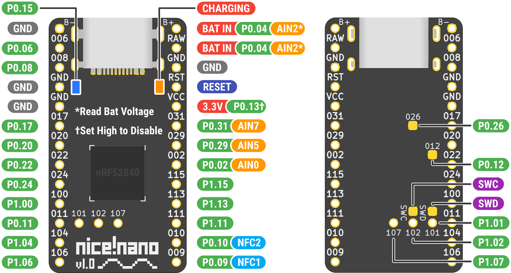

# Pinout

### To further clarify:

- P0.04 (AIN2) is used to read the voltage of the battery via ADC
- P0.13 on VCC shuts off the power to VCC when you set it to high
  - This saves on battery immensely for LEDs of all kinds that eat power even when off
